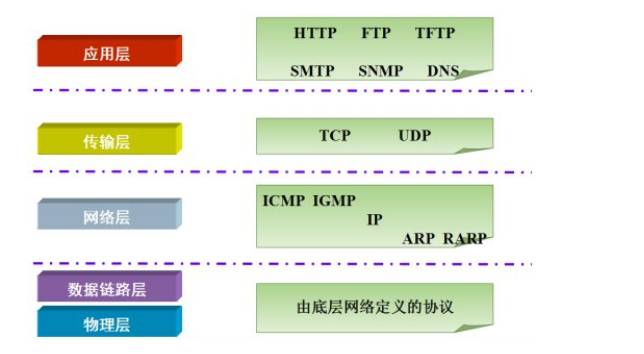
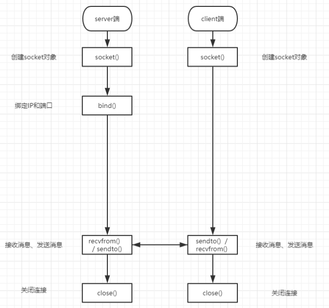

# day11【网络编程和】


## 教学目标

- [ ] 能够辨别UDP和TCP协议特点

  * UDP 无连接，基于数据包，发出去就不管了，性能好，可能丢失数据。
  * TCP有连接，基于通信管道，可靠传输。

- [ ] 能够说出TCP协议下两个常用类名称

  * 客户端Socket
  * 服务端ServerSocket

- [ ] 能够编写TCP协议下字符串数据传输程序

  * 参见代码！

- [ ] 能够理解TCP协议下文件上传案例

  * 参见代码！

- [ ] 能够理解TCP协议下BS案例

  * 参见代码！

- [ ] 能够说出NIO的优点。

  * BIO:同步阻塞式通信，线程要与客户端耦合，没有数据还要死等！并发越高，死的越快！！

  * NIO:同步非阻塞：只需要开始一个线程接收无数个客户端，再开启一个线程负责轮询所有的客户端

    ​	是否有数据，有数据才开启一个线程处理它。适合连接多但是数据短的连接。

    ​	性能较好！！

# 第一章 网络编程入门

## 1.1软件结构

- **C/S结构** ：全称为Client/Server结构，是指客户端和服务器结构。常见程序有ＱＱ、迅雷等软件。


**B/S结构** ：全称为Browser/Server结构，是指浏览器和服务器结构。常见浏览器有谷歌、火狐等。


两种架构各有优势，但是无论哪种架构，都离不开网络的支持。**网络编程**，就是在一定的协议下，实现两台计算机的通信的程序。

## 1.2 网络通信协议

- **网络通信协议：**通信协议是对计算机必须遵守的规则，只有遵守这些规则，计算机之间才能进行通信。这就好比在道路中行驶的汽车一定要遵守交通规则一样，协议中对数据的传输格式、传输速率、传输步骤等做了统一规定，通信双方必须同时遵守，最终完成数据交换。 

- **TCP/IP协议：** 传输控制协议/因特网互联协议( Transmission Control Protocol/Internet Protocol)，是Internet最基本、最广泛的协议。它定义了计算机如何连入因特网，以及数据如何在它们之间传输的标准。它的内部包含一系列的用于处理数据通信的协议，并采用了4层的分层模型，每一层都呼叫它的下一层所提供的协议来完成自己的需求。



## 1.3 协议分类

通信的协议还是比较复杂的，`java.net` 包中包含的类和接口，它们提供低层次的通信细节。我们可以直接使用这些类和接口，来专注于网络程序开发，而不用考虑通信的细节。

`java.net` 包中提供了两种常见的网络协议的支持：

- **TCP**：传输控制协议 (Transmission Control Protocol)。TCP协议是**面向连接**的通信协议，即传输数据之前，在发送端和接收端建立逻辑连接，然后再传输数据，它提供了两台计算机之间可靠无差错的数据传输。
  - 三次握手：TCP协议中，在发送数据的准备阶段，客户端与服务器之间的三次交互，以保证连接的可靠。
    - 第一次握手，客户端向服务器端发出连接请求，等待服务器确认。服务器你死了吗？
    - 第二次握手，服务器端向客户端回送一个响应，通知客户端收到了连接请求。我活着啊！！
    - 第三次握手，客户端再次向服务器端发送确认信息，确认连接。整个交互过程如下图所示。我知道了！！


​    完成三次握手，连接建立后，客户端和服务器就可以开始进行数据传输了。由于这种面向连接的特性，TCP协议可以保证传输数据的安全，所以应用十分广泛，例如下载文件、浏览网页等。

- **UDP**：用户数据报协议(User Datagram Protocol)。UDP协议是一个**面向无连接**的协议。传输数据时，不需要建立连接，不管对方端服务是否启动，直接将数据、数据源和目的地都封装在数据包中，直接发送。每个数据包的大小限制在64k以内。它是不可靠协议，因为无连接，所以传输速度快，但是容易丢失数据。日常应用中,例如视频会议、QQ聊天等。

## 1.4 网络编程三要素

### 协议

- **协议：**计算机网络通信必须遵守的规则，已经介绍过了，不再赘述。

### IP地址

- **IP地址：指互联网协议地址（Internet Protocol Address）**，俗称IP。IP地址用来给一个网络中的计算机设备做唯一的编号。假如我们把“个人电脑”比作“一台电话”的话，那么“IP地址”就相当于“电话号码”。

**IP地址分类 **   [][][][] o o o o

- IPv4：是一个32位的二进制数，通常被分为4个字节，表示成`a.b.c.d` 的形式，例如`192.168.65.100` 。其中a、b、c、d都是0~255之间的十进制整数，那么最多可以表示42亿个。

- IPv6：由于互联网的蓬勃发展，IP地址的需求量愈来愈大，但是网络地址资源有限，使得IP的分配越发紧张。有资料显示，全球IPv4地址在2011年2月分配完毕。

  为了扩大地址空间，拟通过IPv6重新定义地址空间，采用128位地址长度，每16个字节一组，分成8组十六进制数，表示成`ABCD:EF01:2345:6789:ABCD:EF01:2345:6789`，号称可以为全世界的每一粒沙子编上一个网址，这样就解决了网络地址资源数量不够的问题。

**常用命令**

- 查看本机IP地址，在控制台输入：

```java
ipconfig
```

- 检查网络是否连通，在控制台输入：

```java
ping 空格 IP地址
ping 220.181.57.216
ping www.baidu.com
```

**特殊的IP地址**

- 本机IP地址：`127.0.0.1`、`localhost` 。

### 端口号

网络的通信，本质上是两个进程（应用程序）的通信。每台计算机都有很多的进程，那么在网络通信时，如何区分这些进程呢？

如果说**IP地址**可以唯一标识网络中的设备，那么**端口号**就可以唯一标识设备中的进程（应用程序）了。

- **端口号：用两个字节表示的整数，它的取值范围是0~65535**。其中，0~1023之间的端口号用于一些知名的网络服务和应用，普通的应用程序需要使用1024以上的端口号。如果端口号被另外一个服务或应用所占用，会导致当前程序启动失败。

利用`协议`+`IP地址`+`端口号` 三元组合，就可以标识网络中的进程了，那么进程间的通信就可以利用这个标识与其它进程进行交互。ddress

```java
/**
    InetAddress类概述
        * 一个该类的对象就代表一个IP地址对象。

    InetAddress类成员方法
        * static InetAddress getLocalHost()
            * 获得本地主机IP地址对象
        * static InetAddress getByName(String host)
            * 根据IP地址字符串或主机名获得对应的IP地址对象

        * String getHostName();获得主机名
        * String getHostAddress();获得IP地址字符串
 */
public class InetAddressDemo01 {
    public static void main(String[] args) throws Exception {
        // 获得本地主机IP地址对象
        InetAddress inet01 = InetAddress.getLocalHost();
        // pkxingdeMacBook-Pro.local/10.211.55.2
        // 主机名/ip地址字符串
        System.out.println(inet01);
        // 根据IP地址字符串或主机名获得对应的IP地址对象
        // InetAddress inet02 = InetAddress.getByName("192.168.73.97");
        InetAddress inet02 = InetAddress.getByName("baidu.com");
        System.out.println(inet02);

        // 获得主机名
        String hostName = inet01.getHostName();
        System.out.println(hostName);
        // 获得IP地址字符串
        String hostAddress = inet01.getHostAddress();
        System.out.println(hostName);
        System.out.println(hostAddress);
    }
}
```

# 第二章 UDP通信程序

## 2.1 UDP协议概述

​       UDP是无连接通信协议，即在数据传输时，数据的发送端和接收端不建立逻辑连接。简单来说，当一台计算机向另外一台计算机发送数据时，发送端不会确认接收端是否存在，就会发出数据，同样接收端在收到数据时，也不会向发送端反馈是否收到数据。

​		由于使用UDP协议消耗资源小，通信效率高，所以通常都会用于音频、视频和普通数据的传输例如视频会议都使用UDP协议，因为这种情况即使偶尔丢失一两个数据包，也不会对接收结果产生太大影响。

​		但是在使用UDP协议传送数据时，由于UDP的面向无连接性，不能保证数据的完整性，因此在传输重要数据时不建议使用UDP协议。UDP通信过程如下图所示：



```java
UDP协议的特点
    * 面向无连接的协议
    * 发送端只管发送，不确认对方是否能收到。
    * 基于数据包进行数据传输。
    * 发送数据的大小限制64K以内
    * 因为面向无连接，速度快，但是不可靠。

UDP协议的使用场景
    * 即时通讯
    * 在线视频
    * 网络语音电话

UDP协议相关的两个类
    * DatagramPacket
        * 数据包对象
        * 作用：用来封装要发送或要接收的数据，比如：集装箱
    * DategramSocket
        * 发送对象
        * 作用：用来发送或接收数据包，比如：码头

DatagramPacket类构造方法
    * DatagramPacket(byte[] buf, int length, InetAddress address, int port)
        * 创建发送端数据包对象
        * buf：要发送的内容，字节数组
        * length：要发送内容的长度，单位是字节
        * address：接收端的IP地址对象
        * port：接收端的端口号
    * DatagramPacket(byte[] buf, int length)
        * 创建接收端的数据包对象
        * buf：用来存储接收到内容
        * length：能够接收内容的长度

DatagramPacket类常用方法
    * int getLength() 获得实际接收到的字节个数

DatagramSocket类构造方法
    * DatagramSocket() 创建发送端的Socket对象，系统会随机分配一个端口号。
    * DatagramSocket(int port) 创建接收端的Socket对象并指定端口号

DatagramSocket类成员方法
    * void send(DatagramPacket dp) 发送数据包
    * void receive(DatagramPacket p) 接收数据包
```

## 2.2 UDP通信案例

- 需求：教师的电脑的一个程序发送数据，一个程序接收数据，使用的教师本机的ip。

### 2.2.1 UDP发送端代码实现

```java
// UDP发送端代码实现
public class UDPSender {
    public static void main(String[] args)throws Exception{
        // 定义一个字符串：要发送的内容
        String message = "约吗";
        // 字符串转字节数组
        byte[] buf = message.getBytes();
        // 创建数据包对象
        DatagramPacket dp = new DatagramPacket(buf,buf.length,
                InetAddress.getLocalHost(),6666);
        // 创建发送端的发送对象
        DatagramSocket ds = new DatagramSocket(8888);
        // 发送数据包
        ds.send(dp);
        // 关闭发送对象释放端口号
        ds.close();
    }
}
```

### 2.2.2 UDP接收端代码实现

```java
/**
    UDP协议接收端代码实现
 */
public class UDPReceive {
    public static void main(String[] args)throws Exception{
        // 创建接收对象DatagramSocket
        DatagramSocket ds = new DatagramSocket(6666);
        // 创建字节数组用来存储接收接收到的内容
        byte[] buf = new byte[1024];
        // 创建数据包对象
        DatagramPacket dp = new DatagramPacket(buf,buf.length);
        // 接收数据包
        ds.receive(dp);

        // 获得实际接收到的字节个数
        int len = dp.getLength();
        System.out.println("len = " + len);
        // 将字节数组的内容转换为字符串输出
        System.out.println(new String(buf,0,len));

        // 获得发送端的ip地址
        String sendIp = dp.getAddress().getHostAddress();
        // 获得发送端的端口号
        int port  = dp.getPort();
        System.out.println(sendIp);
        System.out.println(port);

        // 关闭Socket对象
        ds.close();
    }
}
```

# 第三章 TCP通信程序

## 3.1 TCP协议概述

- TCP协议是面向连接的通信协议，即在传输数据前先在客户端和服务器端建立逻辑连接，然后再传输数据。它提供了两台计算机之间可靠无差错的数据传输。TCP通信过程如下图所示：


```java
TCP ==> Transfer Control Protocol ==> 传输控制协议
TCP协议的特点
    * 面向连接的协议
    * 只能由客户端主动发送数据给服务器端，服务器端接收到数据之后，可以给客户端响应数据。
    * 通过三次握手建立连接，连接成功形成数据传输通道。
    * 通过四次挥手断开连接
    * 基于IO流进行数据传输
    * 传输数据大小没有限制
    * 因为面向连接的协议，速度慢，但是是可靠的协议。

TCP协议的使用场景
    * 文件上传和下载
    * 邮件发送和接收
    * 远程登录

TCP协议相关的类
    * Socket
        * 一个该类的对象就代表一个客户端程序。
    * ServerSocket
        * 一个该类的对象就代表一个服务器端程序。

Socket类构造方法
    * Socket(String host, int port)
        * 根据ip地址字符串和端口号创建客户端Socket对象
        * 注意事项：只要执行该方法，就会立即连接指定的服务器程序，如果连接不成功，则会抛出异常。
            如果连接成功，则表示三次握手通过。

Socket类常用方法
    * OutputStream getOutputStream(); 获得字节输出流对象
    * InputStream getInputStream();获得字节输入流对象
```


## 3.2 TCP通信案例	

### 3.2.2 客户端向服务器发送数据

```java
/*
TCP客户端代码实现步骤
        * 创建客户端Socket对象并指定服务器地址和端口号
        * 调用Socket对象的getOutputStream方法获得字节输出流对象
        * 调用字节输出流对象的write方法往服务器端输出数据
        * 调用Socket对象的getInputStream方法获得字节输入流对象
        * 调用字节输入流对象的read方法读取服务器端返回的数据
        * 关闭Socket对象断开连接。
 */
// TCP客户端代码实现
public class TCPClient {
    public static void main(String[] args) throws Exception{
        // 要发送的内容
        String content = "你好TCP服务器端，约吗";
        // 创建Socket对象
        Socket socket = new Socket("192.168.73.99",9999);
        // System.out.println(socket);
        // 获得字节输出流对象
        OutputStream out = socket.getOutputStream();
        // 输出数据到服务器端
        out.write(content.getBytes());

        // 获得字节输入流对象
        InputStream in = socket.getInputStream();
        // 创建字节数组：用来存储读取到服务器端数据
        byte[] buf = new byte[1024];
        // 读取服务器端返回的数据
        int len = in.read(buf);
        System.out.println("len = " + len);
        System.out.println("服务器端返回的内容 = " + new String(buf,0,len));

        // 关闭socket对象
        socket.close();
    }
}
```

### 3.3.3 服务器向客户端回写数据

```java
/**
    TCP服务器端代码实现

    ServerSocket类构造方法
        * ServerSocket(int port) 根据指定的端口号开启服务器。

    ServerSocket类常用方法
        *  Socket accept() 等待客户端连接并获得与客户端关联的Socket对象

    TCP服务器端代码实现步骤
        * 创建ServerSocket对象并指定端口号(相当于开启了一个服务器)
        * 调用ServerSocket对象的accept方法等待客端户连接并获得对应Socket对象
        * 调用Socket对象的getInputStream方法获得字节输入流对象
        * 调用字节输入流对象的read方法读取客户端发送的数据
        * 调用Socket对象的getOutputStream方法获得字节输出流对象
        * 调用字节输出流对象的write方法往客户端输出数据
        * 关闭Socket和ServerSocket对象
 */
public class TCPServer {
    public static void main(String[] args)throws Exception{
        // 创建服务器ocket对象
        ServerSocket serverSocket = new ServerSocket(9999);
        // 等待客户端连接并获得与客户端关联的Socket对象
        Socket socket = serverSocket.accept();
        // 获得字节输入流对象
        InputStream in = socket.getInputStream();
        // 创建字节数组：用来存储读取到客户端发送的数据
        byte[] buf = new byte[1024];
        // 读取客户端发送过来的数据
        int len = in.read(buf);
        System.out.println("len = " + len);
        System.out.println("客户端发送的数据 = " + new String(buf,0,len));

        // 获得字节输出流对象
        OutputStream out = socket.getOutputStream();
        // 往客户端输出数据
        out.write("约你妹".getBytes());
       
        
        // 关闭socket
        socket.close();
        // 关闭服务器（在实际开发中，服务器一般不会关闭）
        serverSocket.close();
    }
}
```

# 第四章 综合案例

## 4.1 文件上传案例

### 文件上传分析图解

1. 【客户端】输入流，从硬盘读取文件数据到程序中。
2. 【客户端】输出流，写出文件数据到服务端。
3. 【服务端】输入流，读取文件数据到服务端程序。
4. 【服务端】输出流，写出文件数据到服务器硬盘中。

5. 【服务端】获取输出流，回写数据。
6. 【客户端】获取输入流，解析回写数据。


### 案例实现

服务器端实现：

```java
public class FileUpload_Server {
    public static void main(String[] args) throws IOException {
        System.out.println("服务器 启动.....  ");
        // 1. 创建服务端ServerSocket
        ServerSocket serverSocket = new ServerSocket(6666);
        // 2. 循环接收,建立连接
        while (true) {
            Socket accept = serverSocket.accept();
          	/*
          	3. socket对象交给子线程处理,进行读写操作
               Runnable接口中,只有一个run方法,使用lambda表达式简化格式
            */
            new Thread(() -> {
                try (
                    //3.1 获取输入流对象
                    BufferedInputStream bis = new BufferedInputStream(accept.getInputStream());
                    //3.2 创建输出流对象, 保存到本地 .
                    FileOutputStream fis = new FileOutputStream(System.currentTimeMillis() + ".jpg");
                    BufferedOutputStream bos = new BufferedOutputStream(fis);
                ) {
                    // 3.3 读写数据
                    byte[] b = new byte[1024 * 8];
                    int len;
                    while ((len = bis.read(b)) != -1) {
                        bos.write(b, 0, len);
                    }

                    // 4.=======信息回写===========================
                    System.out.println("back ........");
                    OutputStream out = accept.getOutputStream();
                    out.write("上传成功".getBytes());
                    out.close();
                    //================================

                    //5. 关闭 资源
                    bos.close();
                    bis.close();
                    accept.close();
                    System.out.println("文件上传已保存");
                } catch (IOException e) {
                    e.printStackTrace();
                }
            }).start();
        }
    }
}
```

客户端实现：

```java
public class FileUpload_Client {
    public static void main(String[] args) throws IOException {
        // 1.创建流对象
        // 1.1 创建输入流,读取本地文件
        BufferedInputStream bis = new BufferedInputStream(new FileInputStream("test.jpg"));
        // 1.2 创建输出流,写到服务端
        Socket socket = new Socket("localhost", 6666);
        BufferedOutputStream bos = new BufferedOutputStream(socket.getOutputStream());

        //2.写出数据.
        byte[] b  = new byte[1024 * 8 ];
        int len ;
        while (( len  = bis.read(b))!=-1) {
            bos.write(b, 0, len);
        }
      	// 关闭输出流,通知服务端,写出数据完毕
        socket.shutdownOutput();
        System.out.println("文件发送完毕");
        // 3. =====解析回写============
        InputStream in = socket.getInputStream();
        byte[] back = new byte[20];
        in.read(back);
        System.out.println(new String(back));
        in.close();
        // ============================

        // 4.释放资源
        socket.close();
        bis.close();
    }
}
```

## 4.2 模拟B\S服务器

模拟网站服务器，使用浏览器访问自己编写的服务端程序，查看网页效果。

### 案例分析

1. 准备页面数据，web文件夹。
2. 我们模拟服务器端，ServerSocket类监听端口，使用浏览器访问，查看网页效果

### 案例实现

浏览器工作原理是遇到图片会开启一个线程进行单独的访问,因此在服务器端加入线程技术。

```java
public class ServerDemo {
    public static void main(String[] args) throws IOException {
        ServerSocket server = new ServerSocket(8888);
        while(true){
            Socket socket = server.accept();
            new Thread(new Web(socket)).start();
        }
    }
}  
```

```java
class Web implements Runnable{
    private Socket socket;

    public Web(Socket socket){
        this.socket=socket;
    }

    public void run() {
        try{
            //转换流,读取浏览器请求第一行
            BufferedReader readWb = new
                    BufferedReader(new InputStreamReader(socket.getInputStream()));
            String requst = readWb.readLine();
            //取出请求资源的路径
            String[] strArr = requst.split(" ");
            System.out.println(Arrays.toString(strArr));
            String path = strArr[1].substring(1);
            System.out.println(path);

            FileInputStream fis = new FileInputStream(path);
            System.out.println(fis);
            byte[] bytes= new byte[1024];
            int len = 0 ;

            //向浏览器 回写数据
            OutputStream out = socket.getOutputStream();
            out.write("HTTP/1.1 200 OK\r\n".getBytes());
            out.write("Content-Type:text/html\r\n".getBytes());
            out.write("\r\n".getBytes());
            while((len = fis.read(bytes))!=-1){
                out.write(bytes,0,len);
            }
            fis.close();
            out.close();
            readWb.close();
            socket.close();
        }catch(Exception ex){

        }
    }
}
```

**访问效果：**


**图解：**


# 第五章 NIO 

## 5.1 NIO概述 

### 5.1.1  NIO引入

在我们学习Java的NIO流之前，我们都要了解几个关键词

* 同步 与异步（synchronous/asynchronous）：**同步**是一种可靠的有序运行机制，当我们进行同步操作时，后续的任务是等待当前调用返回，才会进行下一步；而**异步**则相反，其他任务不需要等待当前调用返回，通常依靠事件、回调等机制来实现任务间次序关系
* 阻塞与非阻塞：在进行**阻塞**操作时，当前线程会处于阻塞状态，无法从事其他任务，只有当条件就绪才能继续，比如ServerSocket新连接建立完毕，或者数据读取、写入操作完成；而**非阻塞**则是不管IO操作是否结束，直接返回，相应操作在后台继续处理

在Java1.4之前的I/O系统中，提供的都是面向流的I/O系统，系统一次一个字节地处理数据，一个输入流产生一个字节的数据，一个输出流消费一个字节的数据，面向流的I/O速度非常慢，**而在Java 1.4中推出了NIO，这是一个面向块的I/O系统，系统以块的方式处理处理，每一个操作在一步中产生或者消费一个数据库，按块处理要比按字节处理数据快的多。**

在 Java 7 中，NIO 有了进一步的改进，也就是 NIO 2，引入了异步非阻塞 IO 方式，也有很多人叫它 AIO（Asynchronous IO）。异步 IO 操作基于事件和回调机制，可以简单理解为，应用操作直接返回，而不会阻塞在那里，当后台处理完成，操作系统会通知相应线程进行后续工作。

## 5.2 NIO(同步、非阻塞)

**NIO之所以是同步，是因为它的accept/read/write方法的内核I/O操作都会阻塞当前线程**

首先，我们要先了解一下NIO的三个主要组成部分：Channel（通道）、Buffer（缓冲区）、Selector（选择器）

### **5.2.1 Channel（通道）**

Channel（通道）：Channel是一个对象，可以通过它读取和写入数据。可以把它看做是IO中的流，不同的是：

* Channel是双向的，既可以读又可以写，而流是单向的
* Channel可以进行异步的读写
* 对Channel的读写必须通过buffer对象

正如上面提到的，所有数据都通过Buffer对象处理，所以，您永远不会将字节直接写入到Channel中，相反，您是将数据写入到Buffer中；同样，您也不会从Channel中读取字节，而是将数据从Channel读入Buffer，再从Buffer获取这个字节。

因为Channel是双向的，所以Channel可以比流更好地反映出底层操作系统的真实情况。特别是在Unix模型中，底层操作系统通常都是双向的。

在Java NIO中的Channel主要有如下几种类型：

* FileChannel：从文件读取数据的
* DatagramChannel：读写UDP网络协议数据
* SocketChannel：读写TCP网络协议数据
* ServerSocketChannel：可以监听TCP连接

### 5.2.2 Buffer

Buffer是一个对象，它包含一些要写入或者读到Stream对象的。应用程序不能直接对 Channel 进行读写操作，而必须通过 Buffer 来进行，即 Channel 是通过 Buffer 来读写数据的。

在NIO中，所有的数据都是用Buffer处理的，它是NIO读写数据的中转池。Buffer实质上是一个数组，通常是一个字节数据，但也可以是其他类型的数组。但一个缓冲区不仅仅是一个数组，重要的是它提供了对数据的结构化访问，而且还可以跟踪系统的读写进程。

使用 Buffer 读写数据一般遵循以下四个步骤：

1.写入数据到 Buffer；

2.调用 flip() 方法；

3.从 Buffer 中读取数据；

4.调用 clear() 方法或者 compact() 方法。

当向 Buffer 写入数据时，Buffer 会记录下写了多少数据。一旦要读取数据，需要通过 flip() 方法将 Buffer 从写模式切换到读模式。在读模式下，可以读取之前写入到 Buffer 的所有数据。

一旦读完了所有的数据，就需要清空缓冲区，让它可以再次被写入。有两种方式能清空缓冲区：调用 clear() 或 compact() 方法。clear() 方法会清空整个缓冲区。compact() 方法只会清除已经读过的数据。任何未读的数据都被移到缓冲区的起始处，新写入的数据将放到缓冲区未读数据的后面。

Buffer主要有如下几种：

* ByteBuffer
* CharBuffer
* DoubleBuffer
* FloatBuffer
* IntBuffer
* LongBuffer
* ShortBuffer

我们将通过CopyFile这个实力让大家体会NIO的操作过程。CopyFile执行三个基本的操作：创建一个Buffer，然后从源文件读取数据到缓冲区，然后再将缓冲区写入目标文件。

```java
public static void copyFileUseNIO(String src,String dst) throws IOException{
//声明源文件和目标文件
        FileInputStream fi=new FileInputStream(new File(src));
        FileOutputStream fo=new FileOutputStream(new File(dst));
        //获得传输通道channel
        FileChannel inChannel=fi.getChannel();
        FileChannel outChannel=fo.getChannel();
        //获得容器buffer
        ByteBuffer buffer=ByteBuffer.allocate(1024);
        while(true){
            //判断是否读完文件
            int eof =inChannel.read(buffer);
            if(eof==-1){
                break;  
            }
            //重设一下buffer的position=0，limit=position
            buffer.flip();
            //开始写
            outChannel.write(buffer);
            //写完要重置buffer，重设position=0,limit=capacity
            buffer.clear();
        }
        inChannel.close();
        outChannel.close();
        fi.close();
        fo.close();
}   
```

### 5.2.3 Selector

首先需要了解一件事情就是线程上下文切换开销会在高并发时变得很明显，这是同步阻塞方式的低扩展性劣势。

Selector是一个对象，它可以注册到很多个Channel上，监听各个Channel上发生的事件，并且能够根据事件情况决定Channel读写。这样，通过一个线程管理多个Channel，就可以处理大量网络连接了。

有了Selector，我们就可以利用一个线程来处理所有的channels。线程之间的切换对操作系统来说代价是很高的，并且每个线程也会占用一定的系统资源。所以，对系统来说使用的线程越少越好。

#### 1.如何创建一个Selector

Selector 就是您注册对各种 I/O 事件兴趣的地方，而且当那些事件发生时，就是这个对象告诉您所发生的事件。

```java
Selector selector = Selector.open();
```

#### 2.注册Channel到Selector

为了能让Channel和Selector配合使用，我们需要把Channel注册到Selector上。通过调用 channel.register（）方法来实现注册：

```java
channel.configureBlocking(false);
SelectionKey key =channel.register(selector,SelectionKey.OP_READ);
```

注意，注册的Channel 必须设置成异步模式 才可以,否则异步IO就无法工作，这就意味着我们不能把一个FileChannel注册到Selector，因为FileChannel没有异步模式，但是网络编程中的SocketChannel是可以的。

#### 3.关于SelectionKey

请注意对register()的调用的返回值是一个SelectionKey。 SelectionKey 代表这个通道在此 Selector 上注册。当某个 Selector 通知您某个传入事件时，它是通过提供对应于该事件的 SelectionKey 来进行的。SelectionKey 还可以用于取消通道的注册。

SelectionKey中包含如下属性：

* The interest set
* The ready set
* The Channel
* The Selector
* An attached object (optional)

##### (1) Interest set

就像我们在前面讲到的把Channel注册到Selector来监听感兴趣的事件，interest set就是你要选择的感兴趣的事件的集合。你可以通过SelectionKey对象来读写interest set:

```java
int interestSet = selectionKey.interestOps();
boolean isInterestedInAccept  = interestSet & SelectionKey.OP_ACCEPT;
boolean isInterestedInConnect = interestSet & SelectionKey.OP_CONNECT;
boolean isInterestedInRead    = interestSet & SelectionKey.OP_READ;
boolean isInterestedInWrite   = interestSet & SelectionKey.OP_WRITE; 
```

通过上面例子可以看到，我们可以通过用AND 和SelectionKey 中的常量做运算，从SelectionKey中找到我们感兴趣的事件。

##### (2) Ready Set

ready set 是通道已经准备就绪的操作的集合。在一次选Selection之后，你应该会首先访问这个ready set。Selection将在下一小节进行解释。可以这样访问ready集合：

```java
int readySet = selectionKey.readyOps();
```

可以用像检测interest集合那样的方法，来检测Channel中什么事件或操作已经就绪。但是，也可以使用以下四个方法，它们都会返回一个布尔类型：

```java
selectionKey.isAcceptable();
selectionKey.isConnectable();
selectionKey.isReadable();
selectionKey.isWritable();
```

##### (3) Channel 和 Selector

我们可以通过SelectionKey获得Selector和注册的Channel：

```java
Channel  channel  = selectionKey.channel();
Selector selector = selectionKey.selector(); 
```

##### (4) Attach一个对象

可以将一个对象或者更多信息attach 到SelectionKey上，这样就能方便的识别某个给定的通道。例如，可以附加 与通道一起使用的Buffer，或是包含聚集数据的某个对象。使用方法如下：

```java
selectionKey.attach(theObject);
Object attachedObj = selectionKey.attachment();
```

还可以在用register()方法向Selector注册Channel的时候附加对象。如：

```java
SelectionKey key = channel.register(selector, SelectionKey.OP_READ, theObject);
```

#### 4.关于SelectedKeys()

**生产系统中一般会额外进行就绪状态检查**

一旦调用了select()方法，它就会返回一个数值，表示一个或多个通道已经就绪，然后你就可以通过调用selector.selectedKeys()方法返回的SelectionKey集合来获得就绪的Channel。请看演示方法：

```java
Set<SelectionKey> selectedKeys = selector.selectedKeys();
```

当你通过Selector注册一个Channel时，channel.register()方法会返回一个SelectionKey对象，这个对象就代表了你注册的Channel。这些对象可以通过selectedKeys()方法获得。你可以通过迭代这些selected key来获得就绪的Channel，下面是演示代码：

```java
Set<SelectionKey> selectedKeys = selector.selectedKeys();
Iterator<SelectionKey> keyIterator = selectedKeys.iterator();
while(keyIterator.hasNext()) { 
    SelectionKey key = keyIterator.next();
    if(key.isAcceptable()) {
        // a connection was accepted by a ServerSocketChannel.
    } else if (key.isConnectable()) {
        // a connection was established with a remote server.
    } else if (key.isReadable()) {
        // a channel is ready for reading
    } else if (key.isWritable()) {
        // a channel is ready for writing
    }
    keyIterator.remove();
}
```

这个循环遍历selected key的集合中的每个key，并对每个key做测试来判断哪个Channel已经就绪。

请注意循环中最后的keyIterator.remove()方法。Selector对象并不会从自己的selected key集合中自动移除SelectionKey实例。我们需要在处理完一个Channel的时候自己去移除。当下一次Channel就绪的时候，Selector会再次把它添加到selected key集合中。

SelectionKey.channel()方法返回的Channel需要转换成你具体要处理的类型，比如是ServerSocketChannel或者SocketChannel等等。

> IO 都是同步阻塞模式，所以需要多线程以实现多任务处理。而 NIO 则是利用了单线程轮询事件的机制，通过高效地定位就绪的 Channel，来决定做什么，仅仅 select 阶段是阻塞的，可以有效避免大量客户端连接时，频繁线程切换带来的问题，应用的扩展能力有了非常大的提高

## 5.3 NIO2（==AIO）(异步、非阻塞)

AIO是异步IO的缩写，虽然NIO在网络操作中，提供了非阻塞的方法，但是NIO的IO行为还是同步的。对于NIO来说，我们的业务线程是在IO操作准备好时，得到通知，接着就由这个线程自行进行IO操作，IO操作本身是同步的。

但是对AIO来说，则更加进了一步，它不是在IO准备好时再通知线程，而是在IO操作已经完成后，再给线程发出通知。因此AIO是不会阻塞的，此时我们的业务逻辑将变成一个回调函数，等待IO操作完成后，由系统自动触发。

与NIO不同，当进行读写操作时，只须直接调用API的read或write方法即可。这两种方法均为异步的，对于读操作而言，当有流可读取时，操作系统会将可读的流传入read方法的缓冲区，并通知应用程序；对于写操作而言，当操作系统将write方法传递的流写入完毕时，操作系统主动通知应用程序。 即可以理解为，read/write方法都是异步的，完成后会主动调用回调函数。 在JDK1.7中，这部分内容被称作NIO.2，主要在Java.nio.channels包下增加了下面四个异步通道：

* AsynchronousSocketChannel
* AsynchronousServerSocketChannel
* AsynchronousFileChannel
* AsynchronousDatagramChannel

在AIO socket编程中，服务端通道是AsynchronousServerSocketChannel，这个类提供了一个open()静态工厂，一个bind()方法用于绑定服务端IP地址（还有端口号），另外还提供了accept()用于接收用户连接请求。在客户端使用的通道是AsynchronousSocketChannel,这个通道处理提供open静态工厂方法外，还提供了read和write方法。

在AIO编程中，发出一个事件（accept read write等）之后要指定事件处理类（回调函数），AIO中的事件处理类是CompletionHandler<V,A>，这个接口定义了如下两个方法，分别在异步操作成功和失败时被回调。

void completed(V result, A attachment);

void failed(Throwable exc, A attachment);


**Netty框架**：基于NIO 2.0封装好的通信框架，性能优异，稳定好，代码简单，大型技术大量公司经过实战使用以后，发现各方面都很好！！